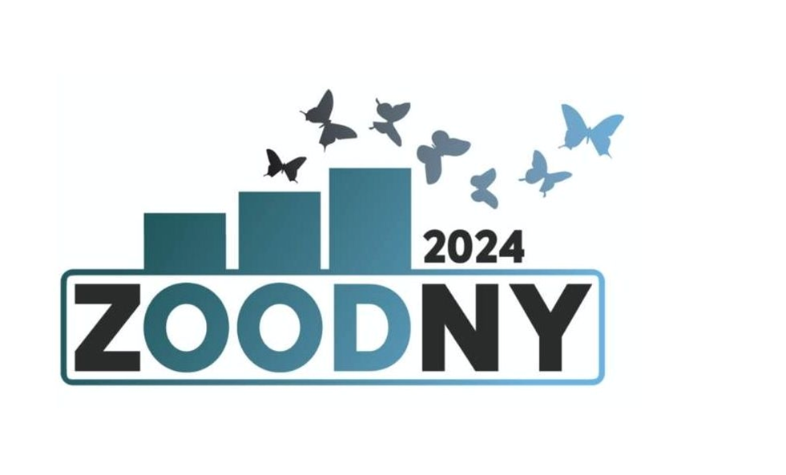
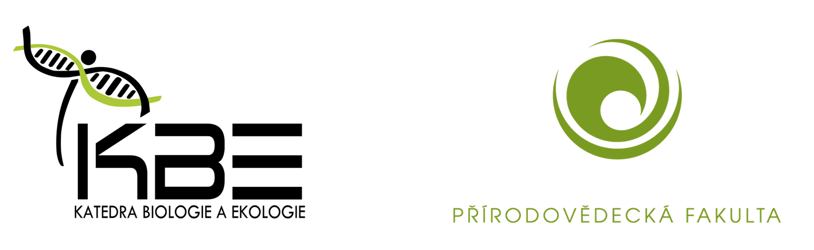

 

# AI in Science: Od Teorie k Praxi 
Pavel Drozd, Petr Pyszko, Veronika Prieložná
## Předpokládaný program Workshopu (07.02.2024)
10:00 – 12:00: VIP exkurze v Zoo (Pouze pro přihlášené) \
12:00 – 14:00: Pauza na oběd \
14:00 – 15:15: Teoretická část (L305)\
15:15 – 15:30: Coffe Break (L337)\
15:30 – 16:45: Praktická část 1 (L305)\
16:45 – 17:00: Coffe Break (L337)\
17:00 – 18:15: Praktická část 2 (L305)\
18:15 – 18:30: Coffe Break (L337)\
18:30 – konec: Praktická část 3 (L305)

 

